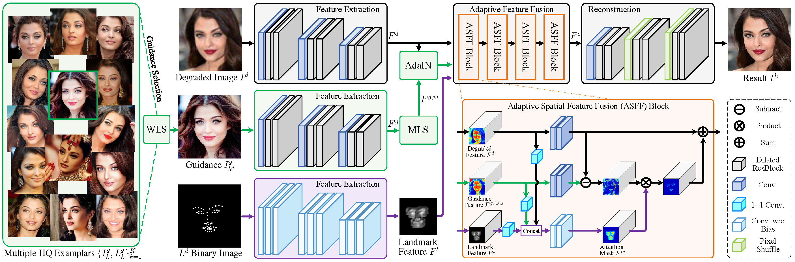

# ASFFNet
Overview of our ASFFNet. WLS is adopted to select the optimal guidance from multiple exemplars, MLS and AdaIN are leveraged for spatial alignment and illumination of guidance image in the feature space, and ASFF layers are introduced to incorporate guidance features in an adaptive and progressive manner.



## Code will be public available after the sponsor's approval.


# Citation

```
@InProceedings{Li_2020_CVPR,
author = {Li, Xiaoming and Li, Wenyu and Ren, Dongwei and Zhang, Hongzhi and Wang, Meng and Zuo, Wangmeng},
title = {Enhanced Blind Face Restoration with Multi-Exemplar Images and Adaptive Spatial Feature Fusion},
booktitle = {CVPR},
year = {2020}
}
```
